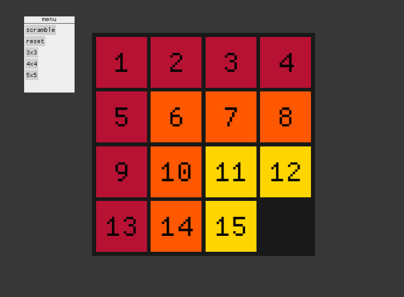

# 15 Puzzle

Siple puzzle game, learning project in Rust.



## build

**desktop:**

```
cargo build
cargo run
```

**wasm:**

```
cargo build --target wasm32-unknown-unknown
cp target/wasm32-unknown-unknown/debug/fifteen_puzzle.wasm www/
```

serve inside /www with: 
```
basic-http-server .
```

## dependencies

**macroquad:**

https://crates.io/crates/macroquad/

https://github.com/not-fl3/macroquad

**tween:**

https://crates.io/crates/tween

https://github.com/sanbox-irl/tween